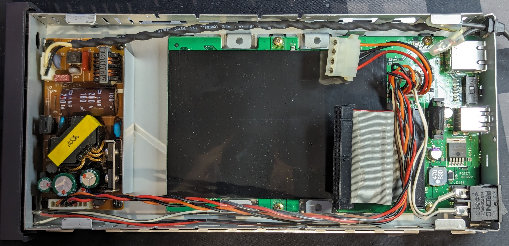
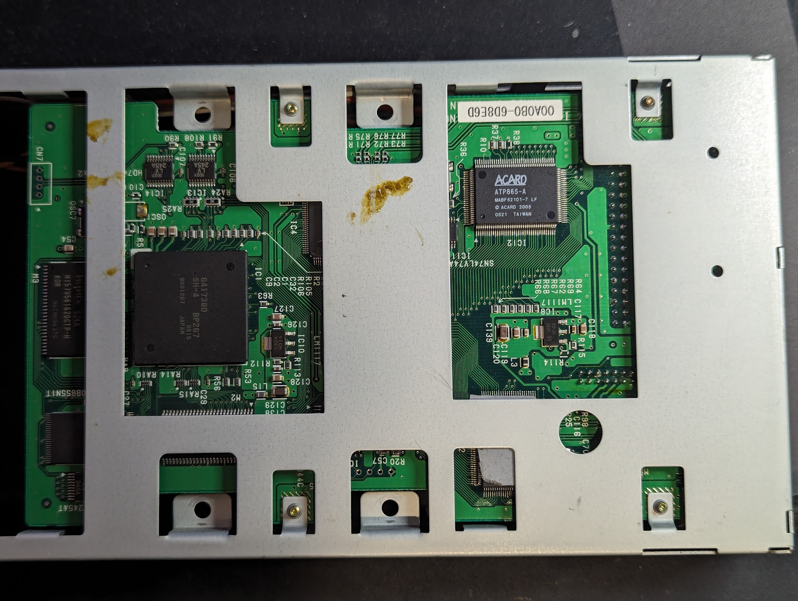
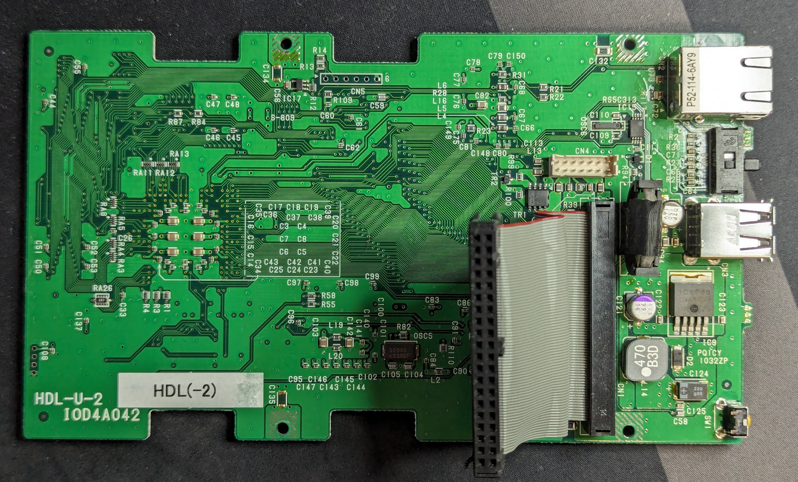
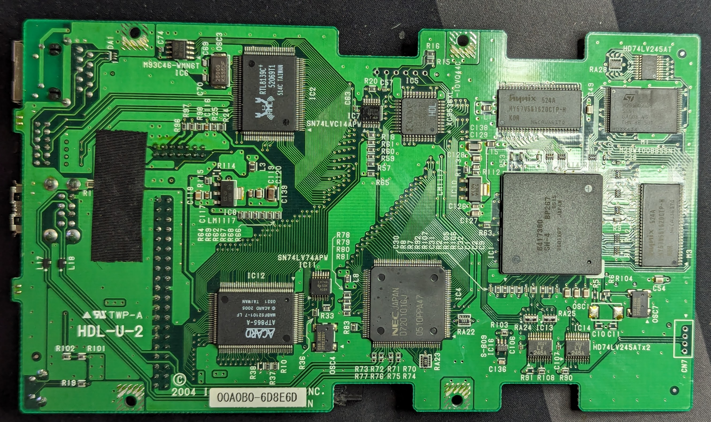

# IO-Data HDL-120U

## Photos





## Peripherals Map
| Area | Memory Address | Description |
| ---- | -------------- | ----------- |

## BOM
| ID | Part Name | Description |
| -- | --------- | ----------- |
| IC1 | Hitachi HD6417380 | SH-4 SH7380 CPU |
| IC2 | Realtek RTL8139C+ | 10/100Mbps Ethernet |
| IC3, IC13, IC14 | 74LV245A | Octal Bus Transceivers with 3-state Outputs |
| IC4 | NEC D720101GJ | 4 Port USB 2.0 PCI Controller |
| IC5 | Xilinx XC9536XL-10VQ44C | CPLD |
| IC6 | ST M93C46-WMN6T | 1K Microwire EEPROM |
| IC7 | SN74LVC14APW | 6x Hex Schmitt-Trigger Inverters |
| IC8 | Onsemi LM1117-33 | 3.3V Linear Voltage Regulator |
| IC9 | Sharp 1CY103 | Switching Voltage Regulator |
| IC10 | LM1117 | Adjustable Linear Voltage Regulator (Configured for ~3.7V) |
| IC11 | SN74LV74APW | Dual Positive-Edge-Triggered D-Type Flip-Flops |
| IC12 | ACARD ATP865-A | PCI Ultra ATA133 IDE Controller |
| IC15 | RS5C313 | Real Time Clock |
| IC16 | Ablic S-809 | Voltage Supervisor |
| IC17 | G8EX | |
| TR1 | Toshiba TPC8402 | P-Channel MOSFET |
| TR2 | XD | |
| M1 | ST M29W400BB55N1T | 4Mbit Flash |
| M2, M3 | Hynix HY57V561620CTP-H | 256Mbit SDRAM |
| OSC3 | 25000 KSS5DF | |
| OSC4 | E66.666C 2PCE236V | |
| OSC5 | 30000 KSS5EF | |
| OSC7 | E22.222C 2PCE236V | |

## Pin Headers
### CN4
```
+----------+----------+----------+----------+----------+----------+----------+
|  Ground  |  Ground  |  Ground  |          | Access   |  Ground  |  Ground  |
|  PSU     |  PSU     | Power SW | Power SW | LED Black|  Molex   |  Molex   |
+----------+----------+----------+----------+----------+----------+----------+
| Orange   | Red      | Power    | Power    | Access   |  Red 5V  | Orange   | <-- Pin 1 Marked with Arrow
| PSU 12V  | PSU 5V   | LED Brown| LED White| LED Red  |  Molex   | Molex 12V|
+----------+----------+----------+----------+----------+----------+----------+
```

### CN5 - CPLD JTAG
```
  Pin1 Marked with Arrow
  v
+----------+----------+----------+----------+----------+----------+
|   TDI    |   TMS    |   TCK    |   TDO    | 3.3V     | Ground   |
+----------+----------+----------+----------+----------+----------+
```

### CN7
```
+----------+----------+----------+----------+
| Ground   |    ?     |   ?      | 3.3V     | <-- Pin 1 Marked with Arrow
+----------+----------+----------+----------+
```
Unsure what these pins do, assumed it was UART, but don't see any
activity with a logic analyzer. Requires further investigation

