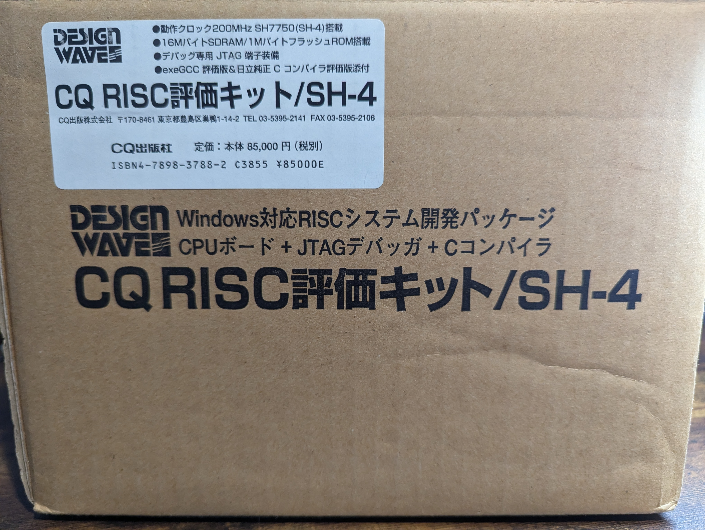
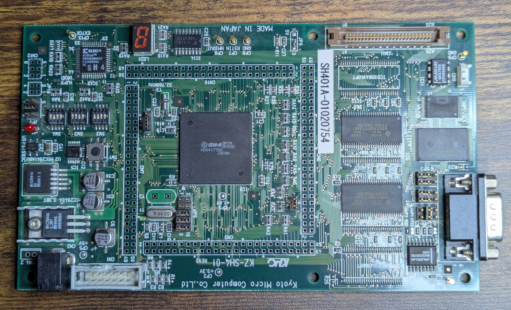
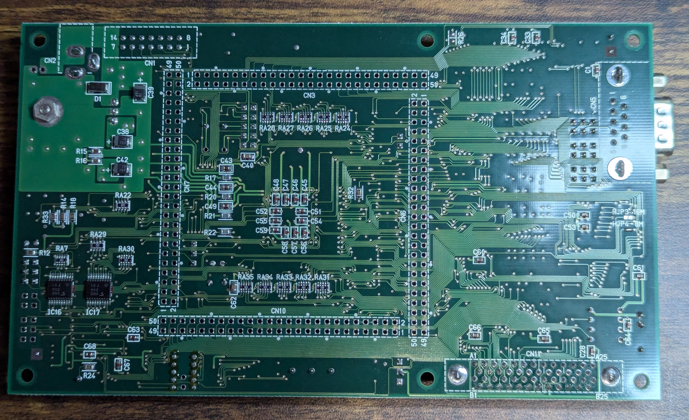

# Kyoto Micro Computer KZ-SH4-01
- https://www.kmckk.co.jp/kz/
- https://www.cqpub.co.jp/eda/CqREEK/SH4.HTM

## Photos

## Peripherals Map
| Area | Memory Address | Description |
| ---- | -------------- | ----------- |
| Area 0 | 0x0000_0000 | 1MB Flash |
| Area 1 | 0x0400_0000 | 1MB Flash? |
| Area 2 | 0x0800_0000 | 16MB SDRAM |
| Area 3 | 0x0C00_0000 |  |
| Area 4 | 0x1000_0000 | 128K SRAM |
| Area 5 | 0x1400_0000 | 7 Seg LED |
| Area 6 | 0x1800_0000 |  |

## Connectors
| ID |   |
| -- | - |
| CN9 | Battery Backup Input |

## Jumpers
| ID |    |
| -- | -- |
| JP4 | SDRAM (Open = Disabled, Bridged = Enabled) |
| JP7 | Something to do with reset? |
| JP5 | Clock Settings |
| SW2, SW3, SW4 | CPU Settings -    Off=1, On=0 |

## BOM
| ID | Part Name | Description |
| -- | --------- | ----------- |

## Modifications
### CN11 ROM Connector
Replaced with TX24-50R-6ST-H1E as it was significantly cheaper and more available than the original.
 
[Pinout](rom_emu_pinout.md)