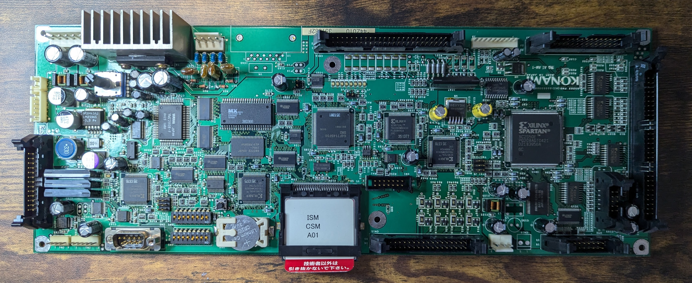
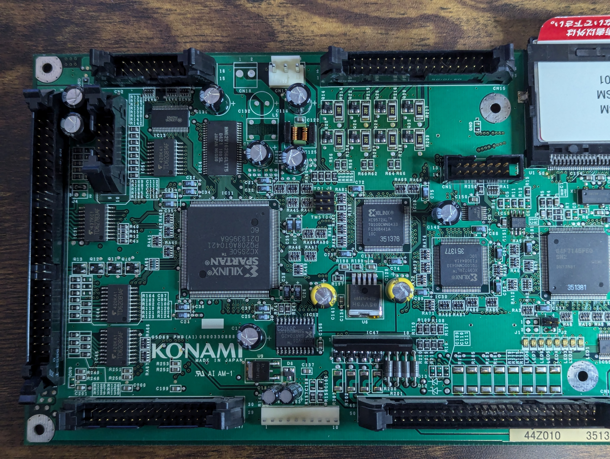
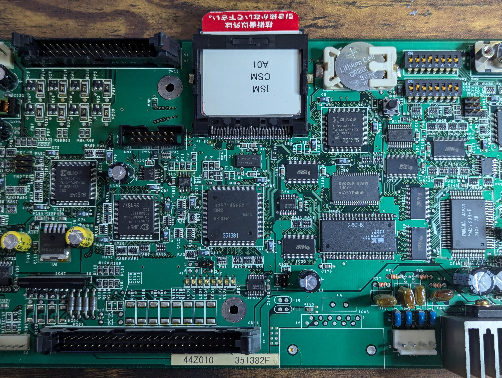
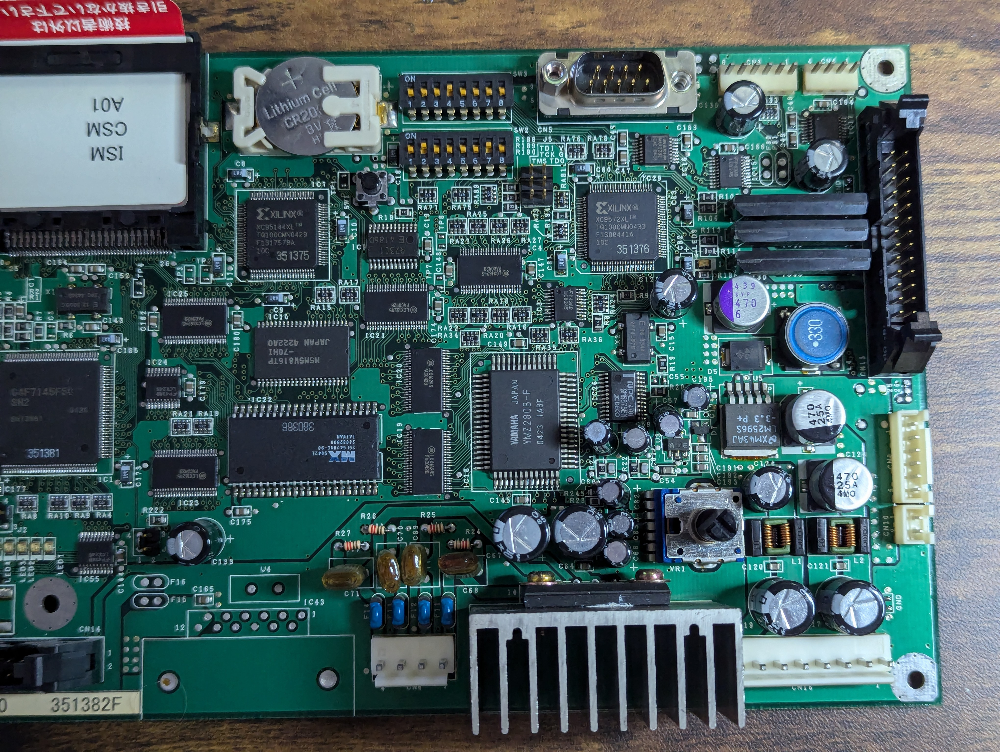
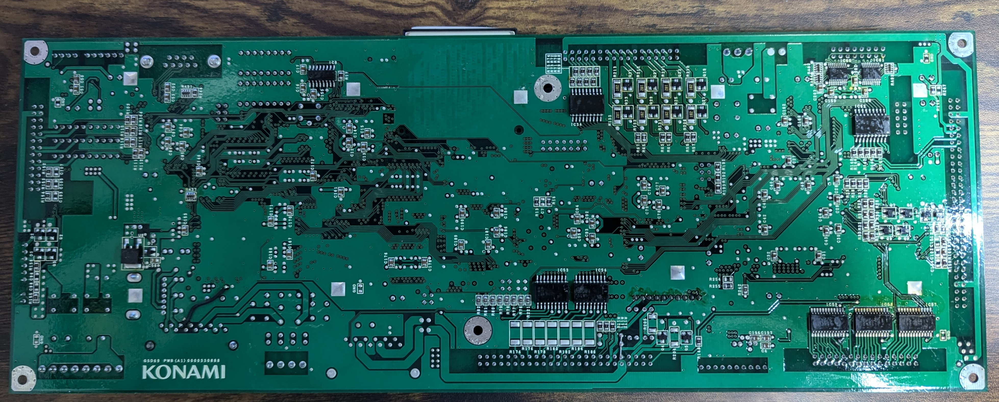

# Konami GSD69 PWB(A1) 0000330888 AI AM-1

## Photos

## Boards
### Board 1
- SN?: 366 063 11088377
- CF: "F60 CSM A01"

### Board 2
- SN?: 44Z010 315382F
- CF: "ISM CSM A01"

## MD5 Sums
- 0de9afb9b19b176beeb7b83693b814a1  f60-csm-a01.bin
- 70b3603473a1692e7d527e8f4b173463  ism-csm-a01.bin
