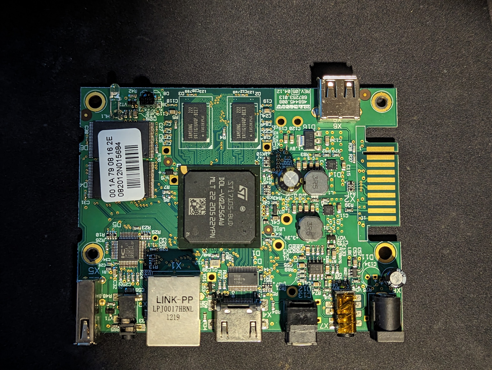
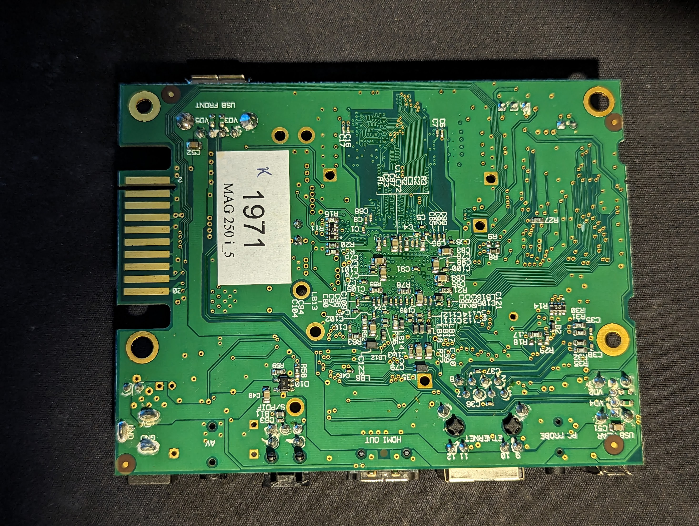

# MAG-250

## Photos
### PCB

## Useful Links :)
Linux on a set-top box: Part 1 - debugger access by polprog: https://www.youtube.com/watch?v=35dPTvBf3rk

## Edge Connector
TOP:
1 -
3 -
5 - 
7 -
9 -
11 -
13 -
15 -
17 -
19 -

Bottom:
2 -
4 -
6 - 
8 -
10 -
12 -
14 -
16 - GND
18 - TX or RX
20 - TX or RX
