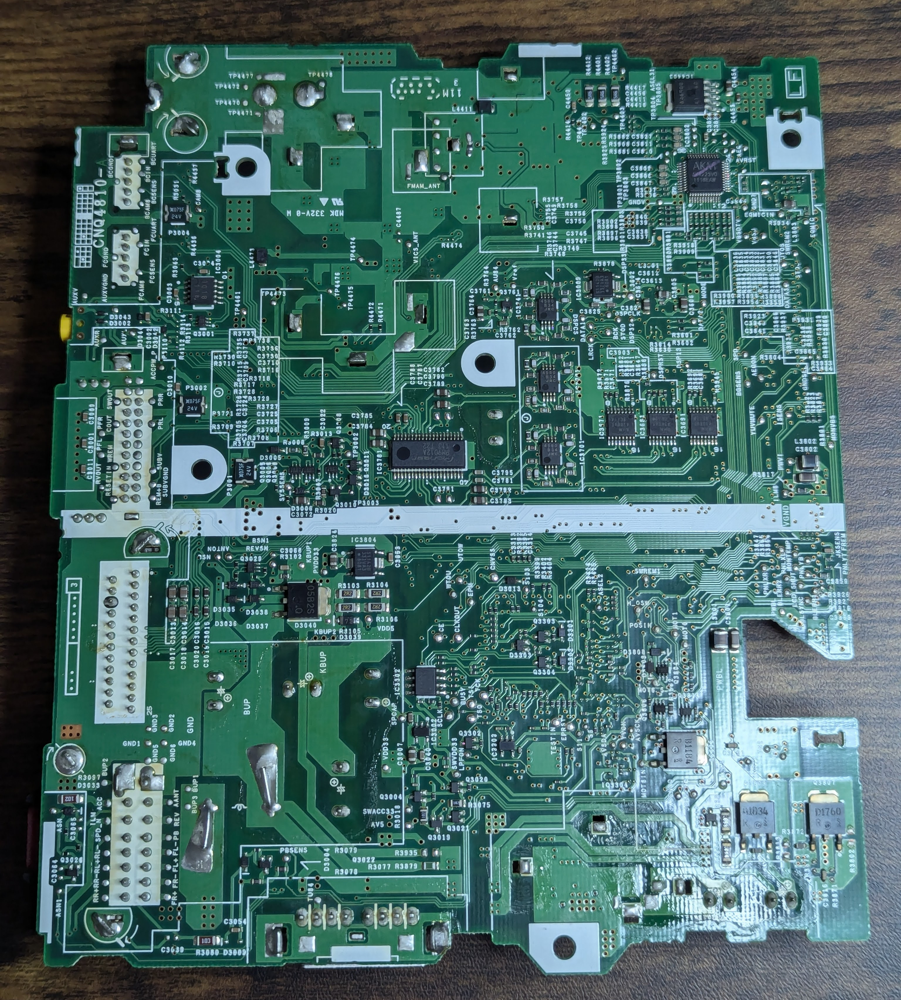
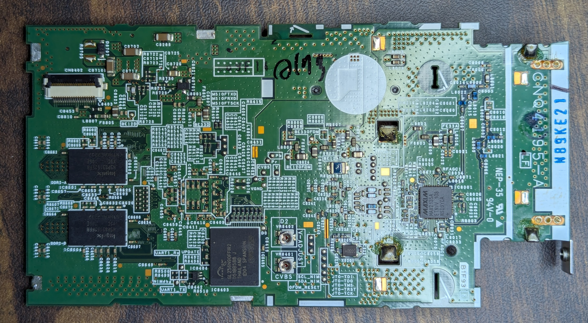

# Pioneer CyberNavi Carrozzeria AVIC-ZH09CS

## Board 1 (Non SuperH)
### Photos

## Board 2 (Non SuperH)
### Photos

## Board 3 (R8A73706DBG)
### Photos

### BOM
| ID | Part Name | Description |
| -- | --------- | ----------- |
| IC8405 | R8A73706DBG | SH-Mobile HD1 SH-4A SoC |
| DDR2-A, DDR2-B, DDR2-C, DDR2-D | Hynix H5PS5162FFR | DDR2 512Mbit |
| IC8403 | Spansion GL256N90FFIR2 | 256Mbit Parallel Flash |
| IC8001 | Maxim MAX2135A | ISDB-T/DVB-T Diversity Tuner |
| IC8201 | Pioneer CM0058BB |  |
| IC8701 | LT3507 | Triple Step-Down Regulator with LDO |

## Board 4 (R8A77770)
### Photos

### BOM
| ID | Part Name | Description |
| -- | --------- | ----------- |
| IC100 | R8A77770 | SH-NaviJ3 SH-4A CPU |
| IC200, IC201, IC250, IC251 | Hynix H5PS1G83EFR | DDR2 1Gbit |
| IC3A1 | EPSON TOYOCOM A8581 | Real Time Clock Module |
| IC2A0 | Macronix MX29GL512ELT2I-10Q | 512Mbit Parallel Flash |

## Board 5 (Non SuperH)
### Photos

