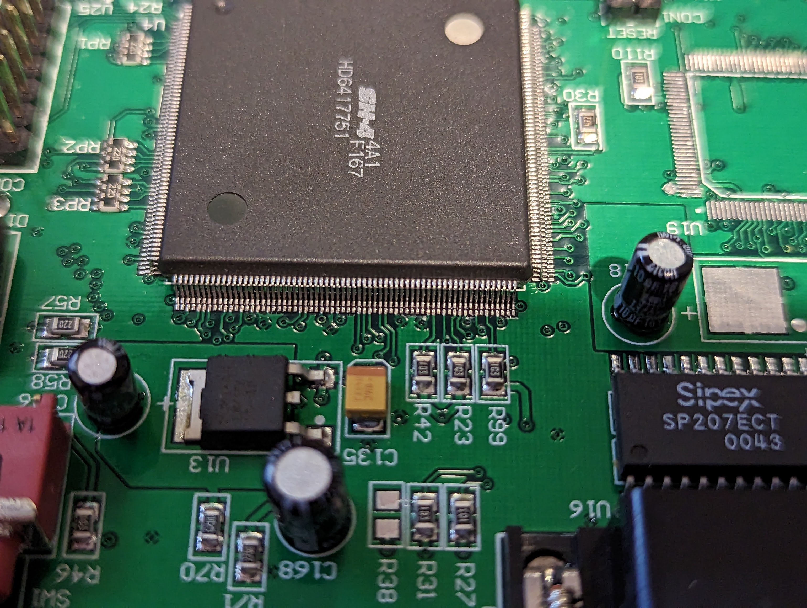

# Snapgear SG530 / Secure Computing SME530

## Photos
### PCB Top



### Attached to E10A-USB

### Custom RP2040 JTAG Probe


## Peripherals Map
| Area | Memory Address | Description |
| ---- | -------------- | ----------- |
| Area 2 | 0x0800_0000 | 16MB SDRAM |
| Area 4 | 0x1000_0000 | Front Panel LEDs (ST 74LCX574) |
| Area 6 | 0x1800_0000 | Watchdog Reset (TI TPS3823) |

## BOM
| ID | Part Name | Description |
| -- | --------- | ----------- |
| U1 | Cypress CY2305 | Zero Delay Buffer |
| U3 | Texas Instruments TPS3823 | Voltage Supervisor Reset IC with Watchdog |
| U4 | Hitachi HD6417751 | SH-4 SH7751 CPU |
| U5, U6 | Hynix HY57V641620HG | 64Mbit SDRAM |
| U7 | Intel TE28F320 | 32Mbit Flash |
| U9 | STMicroelectronics 74LCX574 | Octal Flop-Flop |
| U14 | Sipex SP207ECT | RS232 Transceiver |
| U15 | LM1086CS-3.3 | 1.5A @ 3.3V Voltage Regulator |
| U10 | Fairchild LCX32 | Quad 2-Input OR Gate |
| U2, U11, U12 | Fairchild LCX125 | Quad Buffer |
| U13 | LM1117DT-ADJ | Adjustable Voltage Regulator |
| U17, U18 | Realtek RTL8139C+ | 10/100Mbps Ethernet |
| U21, U22 | Atmel 93C46 | 1Kbits Three-wire Serial EEPROM |
| U24 | Philips 74HC174D | 6 D-type flip-flop with Reset |
| U25 | Dallas DS1302Z | Three-wire Serial RTC |
| OSC1 | HY-Q 33M000 QXO-8CCA  | 33MHz Crystal |
| X1 | 4B27M80C/F | 27MHz Crystal |
| X2, X5 |  | 32.768Khz Crystal |
| X3, X4 | 4B25M00C/F | 25MHz Crystal |


## Disable Hardware Watchdog
This board features an [TI TPS3823](https://www.ti.com/lit/ds/symlink/tps3823.pdf)
near the flash IC labled `U3`. The watchdog timer is connected to CS6n (Pin 10)
on the SH4 so it can be serviced with a memory access at 0x1800_0000. Unfortunately 
this causes issues when attempting to use a JTAG debugger. I worked around this by 
lifting pin 4 which disables the watchdog. 

## LEDs
LEDs are controlled by `U9` which is writable at 0x1000_0000 (Area 4 - CS4n).

## Stock ucLinux Firmware
### Login with telnet
```
User: root
Password: default
```

### Default Boot Args
```
cat /proc/cmdline
mem=16M console=null
```

### Change Boot Args
`flash arg "mem=16M console=ttySC1,57600"`
