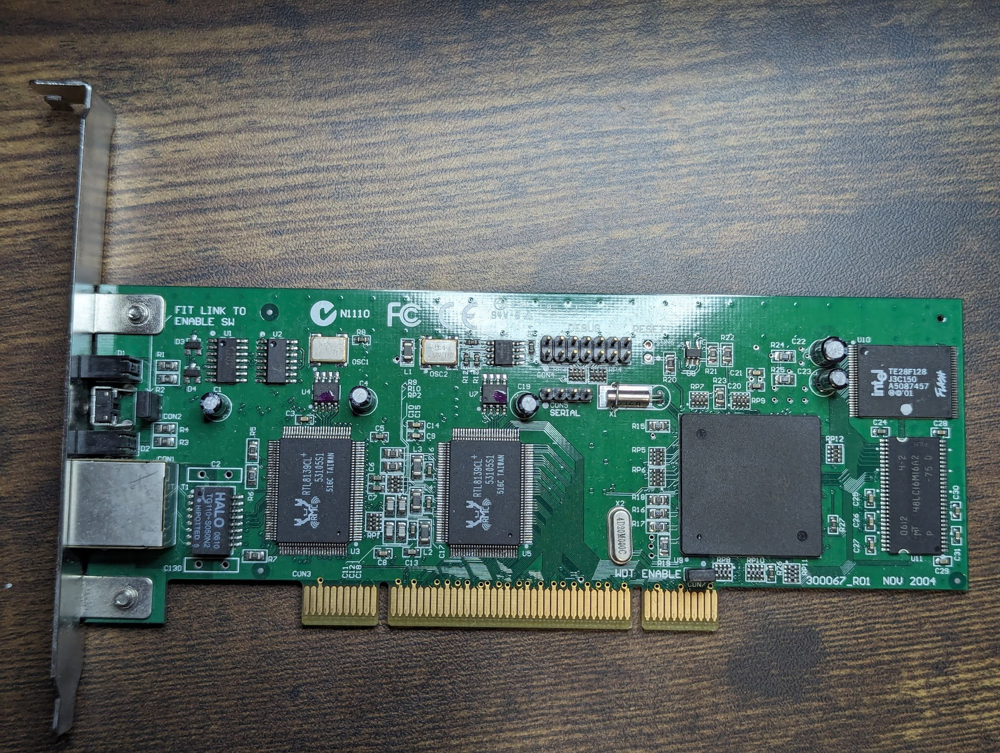
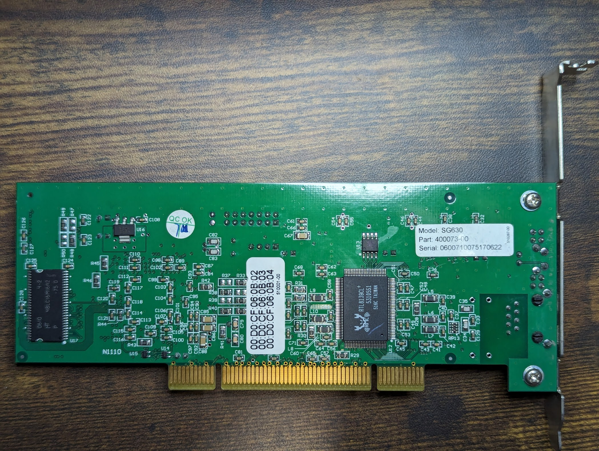

# Snapgear SG630 / Secure Computing SME630

## Photos
### PCB

## Peripherals Map
| Area | Memory Address | Description |
| ---- | -------------- | ----------- |

## BOM
| ID | Part Name | Description |
| -- | --------- | ----------- |
| U1 | LCX74 | |
| U2 | LCX125 | |
| U3, U5, U12 | Realtek RTL8139C+ | 10/100Mbps Ethernet |
| U6 | Cypress CY2305 | Zero Delay Buffer |
| U8 | Texas Instruments TPS3823 | Voltage Supervisor Reset IC with Watchdog |
| U9 | Hitachi HD6417751 | SH-4 SH7751 CPU |
| U10 | Intel TE28F128 | 128Mbit Flash |
| U11, U17 | Micron 48LC16M16A2 | 256Mbit SDRAM |
| U4, U7, U13 | Atmel 93C46 | 1Kbits Three-wire Serial EEPROM |
| U16 | 49RE N03A | |
| OSC1 | ASV 25.0 C  | 25MHz Crystal |
| OSC2 | ASV 33.0 J  | 33MHz Crystal |
| X1 |  | 32.768Khz Crystal |
| X2 | 4D20M00C | |
