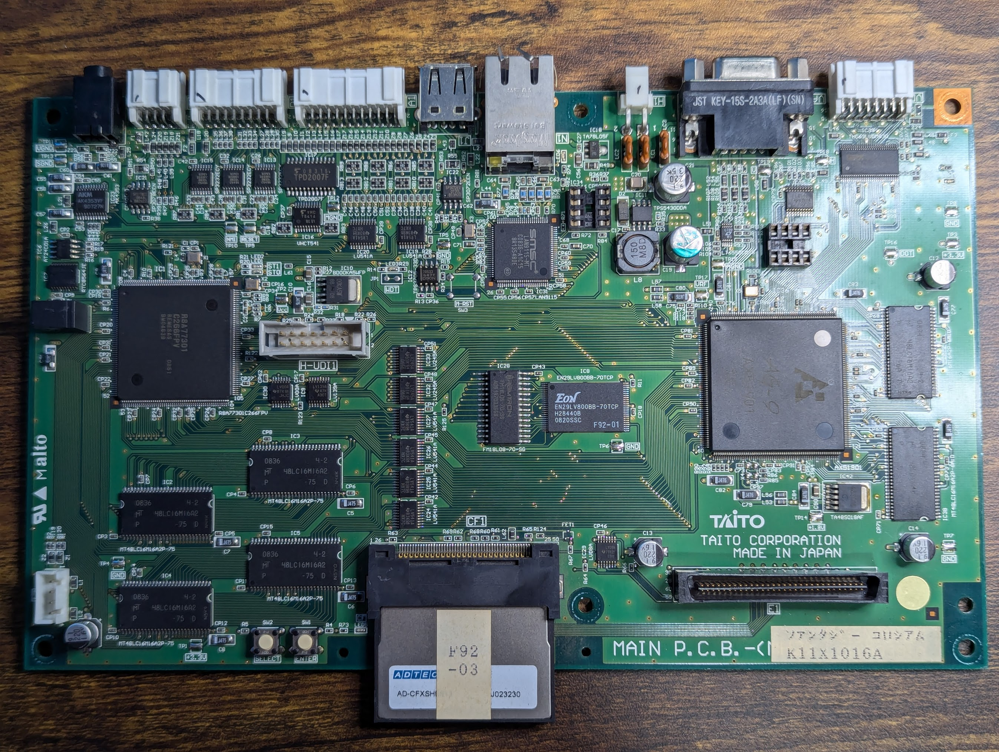
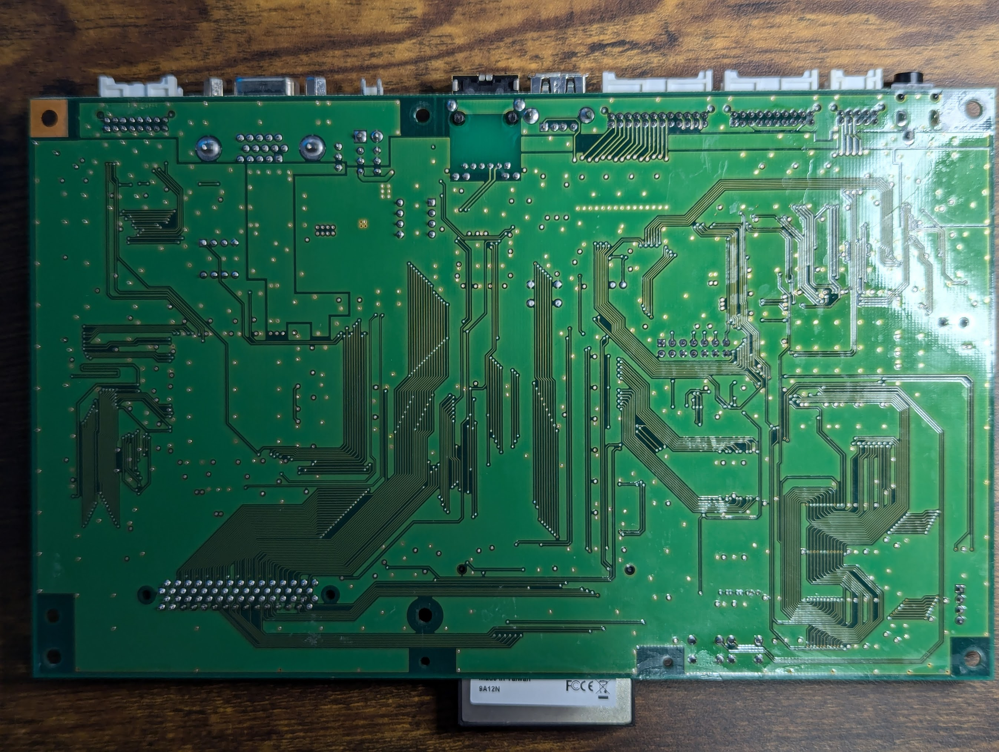
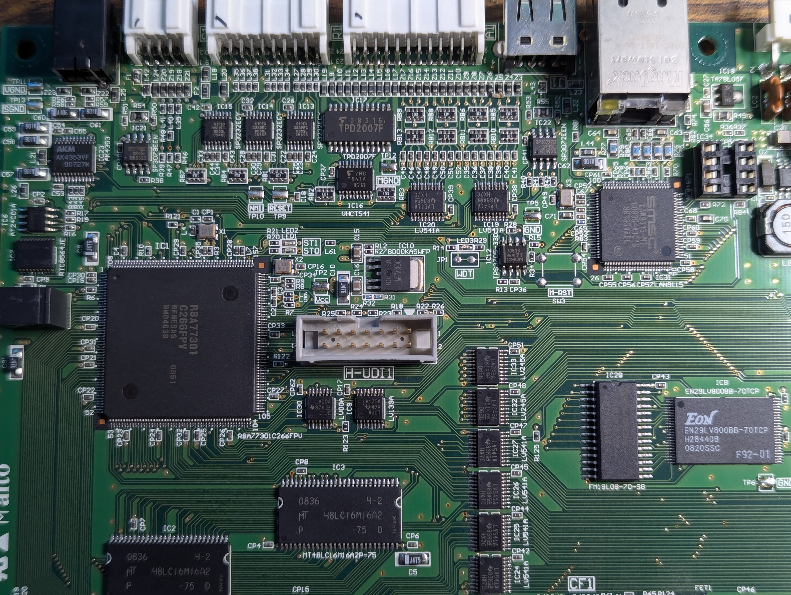
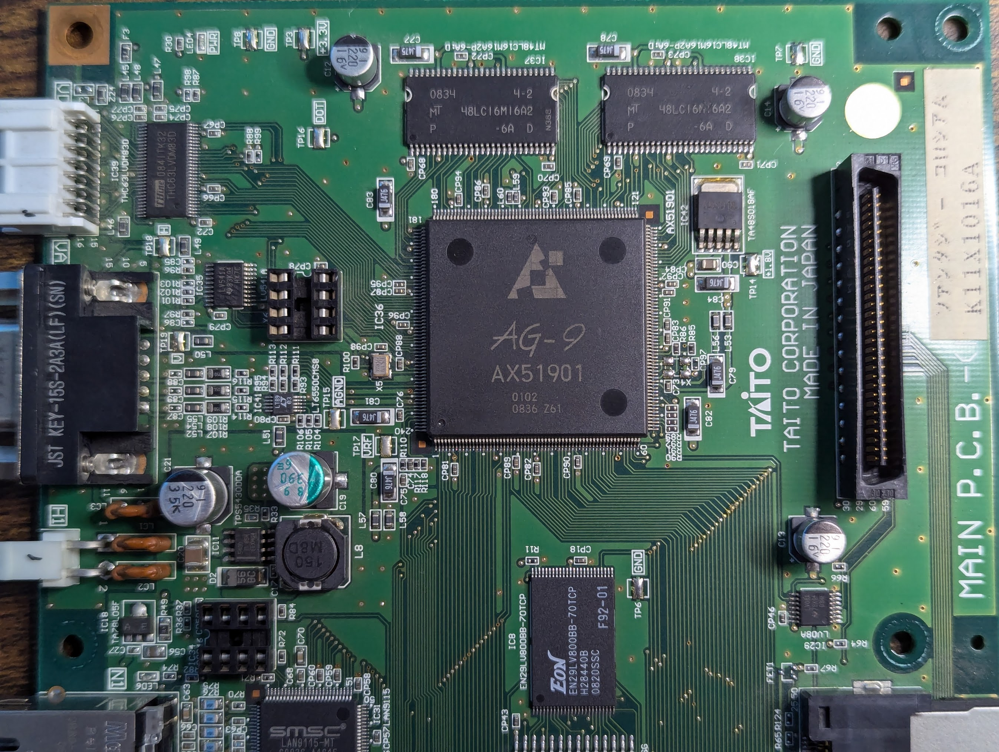
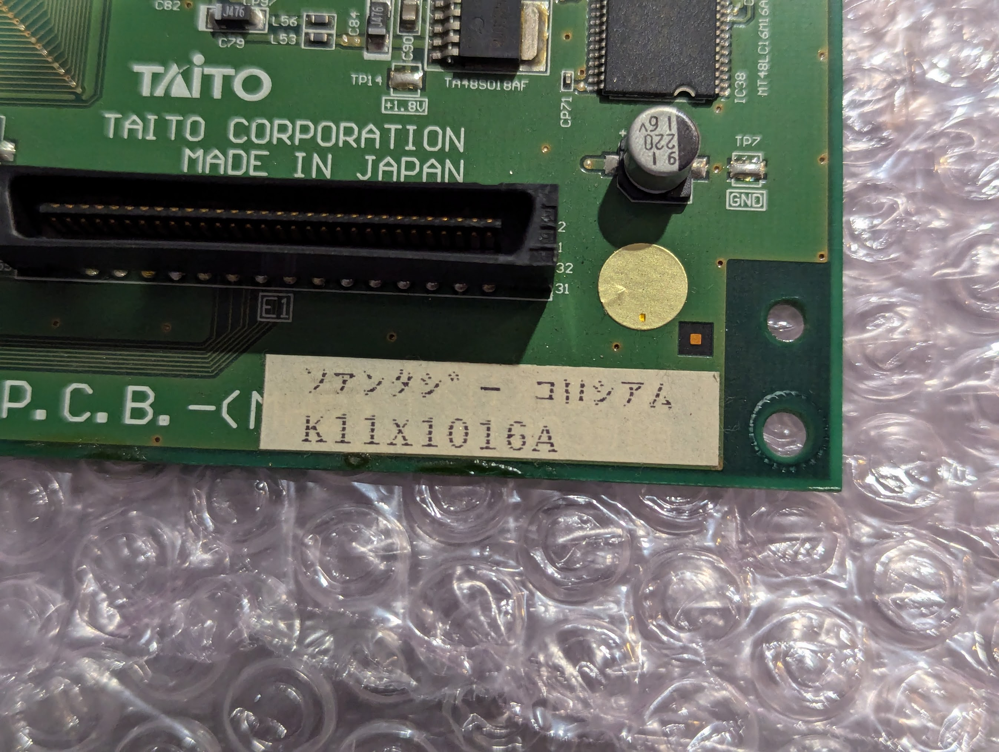

# Taito K11X1016A

- Fantasy Colosseum (?)

## Photos
### PCB






## BOM
| ID | Part Name | Description |
| -- | --------- | ----------- |
| IO4 | Renesas R8A77301 |  |
| IC8 | EON EN29LV800BB-70TCP |  |
| IC2, IC3, IC4, IC5 | Micron MT48LC16M16A2P-75 | 4x 16MB (4M x 16) CPU Memory |
| IC28 | RAMTRON FM18L08-70-SG | 256K (32K x 8) NVRAM |
| IC31 | SMSC LAN9115-MT | 10/100 Ethernet Controller |
| IC36 | AG-9 AX51901 | GPU? |
| IC37, IC38 | MT48LC16M16A2P-6A | 2x 16MB (4M x 16) AG-9 Memory |

## Board 1
- SN: 378100254
- CF Label: F92-03

## Board 2
- SN: 378100341
- CF Label: F92-03-1

## CF Images
### MD5 Sums
- 4df936c31b65ca64e5a5e49aafcf95e1  f92-03.bin
- c8dcdecf28bb7f1e476bcd30e3b929b2  f92-03-01.bin

### Interesting Strings
- 'TAITO MH2 SYSTEM'
- 'MH1 Terminal Debugger'
- 'TAITO;MH2;FANTASY COLOSSEUM;1.01JPN' (f92-03)
- 'TAITO;MH2;FANTASY COLOSSEUM;2.07JPN' (f92-03)
- 'TAITO;MH2;FANTASY COLOSSEUM;2.09JPN' (f92-03-01)

### binwalk f92-03.bin
```
-----------------------------------------------------------------------------------------------------------------------------
DECIMAL                            HEXADECIMAL                        DESCRIPTION
-----------------------------------------------------------------------------------------------------------------------------
90548632                           0x565A998                          CRC32 polynomial table, big endian
90692464                           0x567DB70                          CRC32 polynomial table, big endian
90713600                           0x5682E00                          ZIP archive, file count: 736, total size: 3863004 bytes
96066260                           0x5B9DAD4                          CRC32 polynomial table, little endian
96070356                           0x5B9EAD4                          CRC32 polynomial table, big endian
96077827                           0x5BA0803                          Copyright text: "Copyright 1995-2005 Jean-loup Gailly"
96091859                           0x5BA3ED3                          Copyright text: "Copyright 1995-2005 Mark Adler "
139631228                          0x8529A7C                          ZIP archive, file count: 726, total size: 57372421 bytes
197004800                          0xBBE0E00                          Windows PE binary, machine type: Intel x86
-----------------------------------------------------------------------------------------------------------------------------
```

### binwalk f92-03-01.bin
```
-----------------------------------------------------------------------------------------------------------------------------
DECIMAL                            HEXADECIMAL                        DESCRIPTION
-----------------------------------------------------------------------------------------------------------------------------
282624                             0x45000                            ZIP archive, file count: 736, total size: 3863004 bytes
5635284                            0x55FCD4                           CRC32 polynomial table, little endian
5639380                            0x560CD4                           CRC32 polynomial table, big endian
5646851                            0x562A03                           Copyright text: "Copyright 1995-2005 Jean-loup Gailly"
5660883                            0x5660D3                           Copyright text: "Copyright 1995-2005 Mark Adler "
140528524                          0x8604B8C                          CRC32 polynomial table, big endian
140672368                          0x8627D70                          CRC32 polynomial table, big endian
-----------------------------------------------------------------------------------------------------------------------------
```
